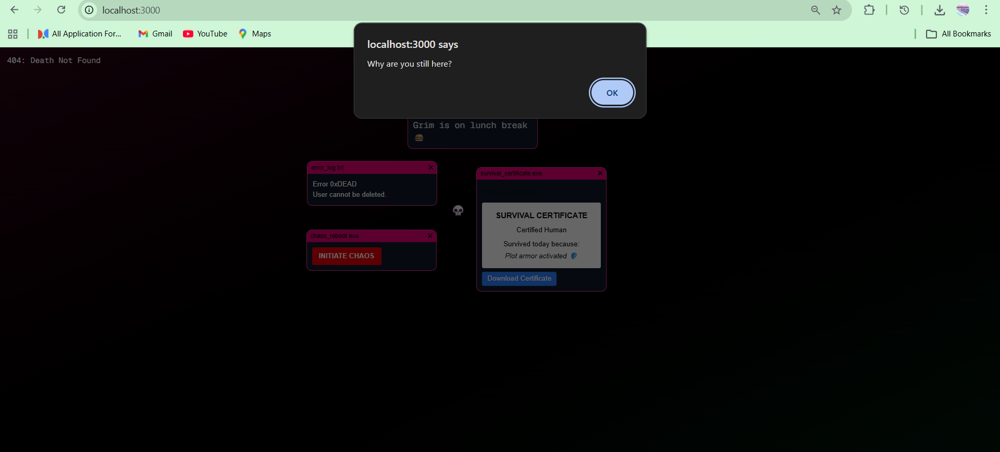

# 💀 Death OS Simulator

An interactive, chaotic OS-style web app built with Next.js.

## 🚀 Features

- 💀 Grim Reaper cursor tracking your mouse
- ⚡ Glitch screen effects
- ⏳ Countdown system
- 😂 Random troll popups
- 🪪 Survival Certificate generator (downloadable)

## 🛠 Tech Stack

- Next.js
- React
- Tailwind CSS
- html2canvas

## 📸 Preview

(Add screenshots here)

## 🧠 Concept

A fun, slightly chaotic simulation of a "death-themed OS" where users interact with windows, survive randomness, and generate a certificate proving they made it through.

## ▶️ Run Locally

```bash
npm install
npm run dev

## 📸 Preview

